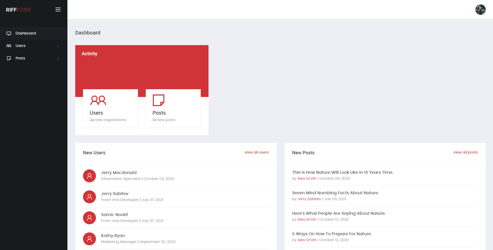

# Angular Admin Panel

Angular Admin Panel is full responsiv web application. Based on Angular 10 and Firebase database. It also include registration\authorization and allow create and manage posts.\
Preview of this template available [here](http://slicing.qs-demo.com/angular-admin/)



## Table of contents

* [Technologies](#technologies)
* [Project setup](#project-setup)
* [Project usage](#project-usage)
* [Project structure](#project-structure)
* [Browsers support](#browsers-support)

## Technologies

* [Angular 10](https://v10.angular.io/docs)
* [Typescript](https://www.typescriptlang.org/)
* [Firebase](https://firebase.google.com/)
* [SCSS](https://sass-lang.com/)
* [Bootsrap 4.6 Grid](https://getbootstrap.com/docs/4.6/getting-started/introduction/)

## Project structure 

``` bash 
angular-admin-panel/
├──dist/
├──src/
│   ├──app/
│   │   ├──admin/
│   │   │   ├──dashboard/
│   │   │   ├──posts/
│   │   │   ├──post-manage/
│   │   │   ├──profile/
│   │   │   ├──users/
│   │   │   └──user-manage/
│   │   ├──auth/
│   │   │   ├──forgot-password/
│   │   │   ├──sign-in/
│   │   │   ├──sign-up/
│   │   │   └──verify-email/
│   │   ├──page-not-found/
│   │   └──shared/
│   │       ├──components/
│   │       ├──guard/
│   │       ├──pipes/
│   │       ├──services/
│   │       └──validators/
│   ├──assets/
│   │   ├──fonts/
│   │   ├──images/
│   │   └──libs/
│   ├──environments/
│   └──styles/
└──package.json
```

## Project setup

``` bash
# clone the repo
$ git clone https://github.com/riffpoint/webcodin/tree/master/alex_s/ap-angular

# go into the directory
$ cd angular-admin-panel

# switch to the dev branch
$ git checkout dev

# install dependencies
$ npm install
```

## Project usage

``` bash
# compiles and hot-reloads for development
$ ng serve

# compiles and minifies for production
$ ng build

# lints and fixes files
$ ng lint
```

## Browsers support

##### Desktop
<table>
  <tbody>
    <tr>
      <td><b>Windows OS</b></td>
      <td>Firefox / Chrome / Edge (last versions)</td>
    </tr>
    <tr>
      <td><b>Mac OS</b></td>
      <td>Firefox / Chrome / Safari (last versions)</td>
    </tr>
  </tbody>
</table>

##### Mobile
<table>
  <tbody>
    <tr>
      <td><b>OS</b></td>
      <td>Android / iOS</td>
    </tr>
    <tr>
      <td><b>Browsers</b></td>
      <td>Chrome / Safari (as default browser for iOS)</td>
    </tr>
  </tbody>
</table>
