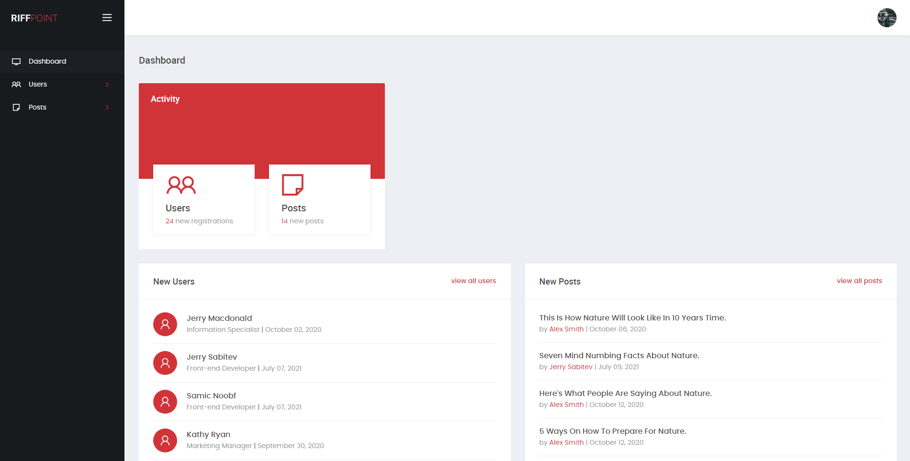

# Vue JS Admin Panel

Vue JS Admin Panel is full responsiv web application. Based on Vue.js 3 and Firebase database. It also include registration\authorization and allow create and manage posts.\
Preview of this template available [here](http://slicing.qs-demo.com/vue-admin)



## Table of contents

* [Technologies](#technologies)
* [Project setup](#project-setup)
* [Project usage](#project-usage)
* [Project structure](#project-structure)
* [Browsers support](#browsers-support)

## Technologies

* [Vue.js 3](https://v3.vuejs.org/)
* [Typescript](https://www.typescriptlang.org/)
* [Vuex](https://next.vuex.vuejs.org/)
* [Firebase](https://firebase.google.com/)
* [SCSS](https://sass-lang.com/)
* [Bootsrap 4.6 Grid](https://getbootstrap.com/docs/4.6/getting-started/introduction/)

## Project structure 

``` bash 
vue-js-admin-panel/
├──dist/
├──public/
├──src/
│   ├──admin/
│   │   ├──dashboard/
│   │   ├──posts/
│   │   ├──profile/
│   │   └──users/
│   ├──assets/
│   │   ├──fonts/
│   │   ├──images/
│   │   └──scss/
│   ├──authorization/
│   │   ├──forgot-password/
│   │   ├──sign-in/
│   │   ├──sign-up/
│   │   └──verify-email/
│   ├──components/
│   ├──router/
│   ├──servises/
│   └──store/
└──package.json
```

## Project setup

``` bash
# clone the repo
$ git clone git@scm.devcodin.com:webcodin-wordpress/vue-js-admin-panel.git

# go into the directory
$ cd vue-js-admin-panel

# switch to the dev branch
$ git checkout dev

# install dependencies
$ npm install
```

## Project usage

``` bash
# compiles and hot-reloads for development
$ npm run serve

# compiles and minifies for production
$ npm run build

# lints and fixes files
$ npm run lint
```

## Browsers support

##### Desktop
<table>
  <tbody>
    <tr>
      <td><b>Windows OS</b></td>
      <td>Firefox / Chrome / Edge (last versions)</td>
    </tr>
    <tr>
      <td><b>Mac OS</b></td>
      <td>Firefox / Chrome / Safari (last versions)</td>
    </tr>
  </tbody>
</table>

##### Mobile
<table>
  <tbody>
    <tr>
      <td><b>OS</b></td>
      <td>Android / iOS</td>
    </tr>
    <tr>
      <td><b>Browsers</b></td>
      <td>Chrome / Safari (as default browser for iOS)</td>
    </tr>
  </tbody>
</table>
